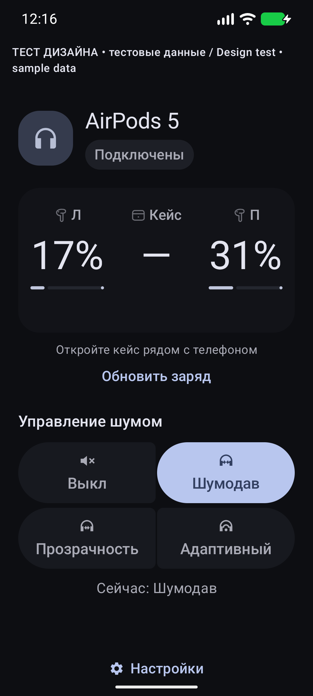
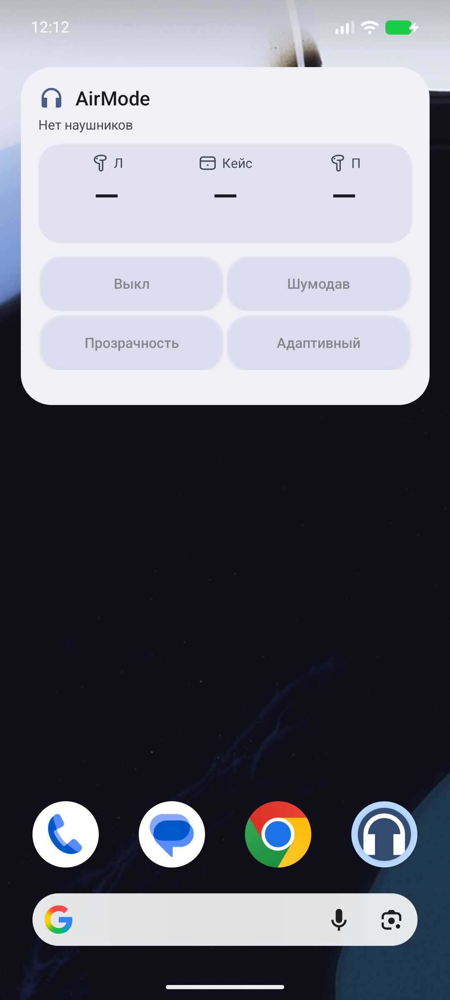

# AirMode — AirPods и Sony на Android

**Бесплатно · Офлайн · Apache-2.0 · Android 12+**

**Русский · [English](#english)**

Заряд наушников, режимы шума, виджет на главном экране и плитка быстрых настроек. Нативный Material 3 Expressive: цвета Android, светлая и тёмная темы, крупные кнопки. Без аккаунта, рекламы, подписки и аналитики.

**[Скачать AirMode 0.2.0 APK](https://github.com/andrewkazavchinskyy-cloud/AirMode/releases/download/v0.2.0/AirMode-0.2.0.apk)** · [Все релизы](https://github.com/andrewkazavchinskyy-cloud/AirMode/releases) · [Инструкция и сайт](https://andrewkazavchinskyy-cloud.github.io/AirMode/) · [Сообщить о проблеме](https://github.com/andrewkazavchinskyy-cloud/AirMode/issues)

**0.2.0 — стабильный публичный релиз.** Пользователь подтвердил хорошую работу с AirPods и отображение заряда Sony. Ранее получены реальные ответы всех четырёх режимов AirPods 5 на Pixel 10 Pro с Android 17. Точная модель Sony пока не указана. Это проверка конкретной конфигурации: доступность функций других моделей и прошивок описана ниже.

<table><tr>
<td width="50%"><br/><sub>Нативный интерфейс Android 17. Этот дизайн-снимок использует обозначенные тестовые данные.</sub></td>
<td width="50%"><br/><sub>Виджет в эмуляторе Android 17. Здесь наушники отключены, поэтому заряд неизвестен.</sub></td>
</tr></table>

## Установка за минуту

1. Скачайте обычный **AirMode-0.2.0.apk** по кнопке выше. GitHub-аккаунт для скачивания не нужен. Файл около 2,4 МБ. Диагностическая версия нужна только для разбора проблемы.
2. Откройте файл. Если Android попросит, разрешите этому браузеру или файловому менеджеру установку неизвестных приложений. После установки разрешение можно выключить. Не отключайте защиту телефона целиком.
3. Сопрягите наушники в **системных настройках Bluetooth**, затем подключите их. AirMode использует уже сопряжённую пару.
4. Откройте AirMode → **Разрешить Bluetooth**. Разрешение «Устройства поблизости» нужно для соединения и чтения заряда. Разрешите уведомления, если хотите всплывающую карточку, затем нажмите **Готово**.
5. Заряд появляется по мере получения данных от наушников. Неизвестное значение — **«—»**. Для кейса откройте его рядом с телефоном и нажмите **Обновить заряд**.

Обновление: установите новый официальный APK поверх прежнего. Подпись сохраняется, настройки остаются. Не удаляйте приложение перед обновлением. Если вы собирали APK своим ключом, Android не разрешит заменить его официальной сборкой поверх.

## Виджет, плитка и уведомления

- **Виджет:** Настройки AirMode → «Добавить виджет на главный экран». Или удерживайте пустое место рабочего стола → Виджеты → AirMode. Виджет показывает доступный заряд; кнопки выбирают режим напрямую.
- **Плитка:** Настройки AirMode → «Добавить плитку в шторку». Если системный запрос недоступен, раскройте шторку полностью → Изменить/карандаш → перетащите AirMode. Нажатие перебирает выбранные в настройках режимы, долгое нажатие открывает приложение.
- **Режимы:** Выкл / Шумодав / Прозрачность / Адаптивный — только если они есть у модели. Выделенный режим подтверждён наушниками. Изменение физической кнопкой или ножкой обновляет приложение и плитку при получении ответа.
- **Карточка заряда:** тихое системное уведомление примерно на 8 секунд при подключении. Постоянный заряд включается отдельно. Уведомления можно запретить: заряд в приложении и управление остаются доступны.

Наушники без ANC показывают заряд без кнопок режимов. Полноразмерные наушники показывают один процент; общий заряд не дублируется в Л/П/Кейс. Управление физической ножкой или кнопкой наушников работает и без AirMode.

## Android и Pixel: что проверено

Приложение устанавливается на **Android 12 и новее**, включая Android 16 и 17. Для управления AirPods нужен доступный канал Bluetooth: на старом стеке или отдельных сборках прошивки может работать только заряд. Проект ориентирован на актуальные Pixel и нативный интерфейс Android 17.

| Конфигурация | Подтверждённый результат |
|---|---|
| Pixel 10 Pro, Android 17 / SDK 37, **CP41.260831.007.A3**, AirPods 5 A3532 | Реальные данные Л/П и ответы режимов 1/2/3/4; пользователь сообщает о хорошей работе AirPods |
| Sony пользователя, модель не уточнена | Пользователь подтвердил отображение заряда; переключение режимов Sony отдельно не подтверждено |
| Эмулятор Android 16 / API 36, BE2A.250530.026.F3 | Установка и запуск официального APK |
| Эмулятор Android 17 beta / API 37, CP41.260731.005.B1, страницы памяти 16 КБ | Установка, запуск, интерфейс, виджет, тёмная тема и увеличенный шрифт |
| Pixel 11 Pro, другие прошивки; Android 17 QPR3 beta **DP11.260918.005/.006** | Целевая совместимость; отдельного физического результата пока нет |

Последние stable/beta Android можно использовать при доступном Bluetooth-канале. Новая beta может изменить системный стек, поэтому результат проверяется для точной сборки, а не только названия телефона. Номер `compileSdk 36` не задаёт верхнюю версию Android: APK проверен и на API 37. Актуальные beta-сборки публикует [Google](https://developer.android.com/about/versions/17/qpr3/release-notes).

[Журнал проверок](docs/VERIFICATION.md) разделяет реальные пользовательские отчёты, эмулятор и ещё открытые аппаратные проверки. Стабильный релиз не означает, что физически проверены все модели и будущие прошивки.

## Совместимые наушники

### Apple AirPods

Реализовано распознавание текущих беспроводных семейств из [справочника Apple](https://support.apple.com/en-us/109525). Команды разрешает подтверждённый номер модели, а не имя Bluetooth.

| Семейство | Заряд | Доступные режимы |
|---|---|---|
| AirPods 1, 2, 3; AirPods 4 без ANC | Л/П/Кейс, когда передаются | Только заряд |
| AirPods 4 ANC; AirPods 5 | Л/П/Кейс, когда передаются | Все четыре |
| AirPods Pro 1 | Л/П/Кейс, когда передаются | Выкл / Шумодав / Прозрачность |
| AirPods Pro 2, 3 | Л/П/Кейс, когда передаются | Все четыре |
| AirPods Max 1 | Один процент | Выкл / Шумодав / Прозрачность |
| AirPods Max 2 | Один процент | Все четыре |

Физически подтверждены AirPods 5 из строки выше; остальные семейства распознаются кодом и требуют проверки конкретной прошивки. Beats и проводные EarPods не реализованы. [Точные номера моделей](app/src/main/java/app/airmode/bluetooth/ModelId.kt).

### Sony

Заряд Sony подтверждён пользовательским тестом, точная модель пока неизвестна. Реализован отдельный нативный MDR V1/V2 канал для семейств WH/WF/WI/MDR/LinkBuds/ULT WEAR: доступные функции определяются реальными ответами модели и прошивки. Полноразмерные модели дают общий заряд; TWS могут отдавать Л/П/Кейс. Поддержанная схема и заявленные возможности разрешают Выкл / Шумодав / Прозрачность. Поддержка каждого Sony не заявляется; неизвестная схема показывает «—» или объясняет недоступность управления.

**Adaptive Sound Control Sony — отдельная функция Sony**, а не четвёртый режим AirPods. Перед проверкой закройте Sony Sound Connect: он может занимать канал управления. [Описание протокола и источники](docs/PROTOCOL.md).

## Если что-то не работает

| Симптом | Что сделать |
|---|---|
| «Нет наушников» | Подключите сопряжённую пару в настройках Bluetooth, включите Bluetooth, разрешите AirMode «Устройства поблизости», снова откройте приложение |
| Кейс показывает «—» | Откройте кейс рядом и нажмите «Обновить заряд». Между сканами не меньше 15 секунд. Закрытый или далёкий кейс может не передавать заряд; процент не придумывается |
| «Данные не свежие» / последнее значение | Это сохранённое показание, а не свежий замер. Поднесите кейс и дождитесь нового пакета |
| Заряд есть, режимы недоступны | Модель без ANC, ещё не определена или телефон не отдаёт канал управления. Для AirPods попробуйте Pixel Android 16 QPR3 / Android 17; аппаратное управление остаётся доступным |
| «Ждём подтверждение» | Наушники ещё не ответили. Выбранный режим изменится после ответа; при отсутствии ответа появится ошибка. Повторите после неё |
| Нет всплывающей карточки | Включите её в настройках AirMode; проверьте системное разрешение уведомлений, канал «Заряд» и «Не беспокоить». Система решает, показывать ли heads-up |
| Не обновляется в фоне | Откройте AirMode, проверьте системные ограничения батареи и включённый автозапуск в настройках приложения |
| Sony не отвечает | Закройте Sound Connect, переподключите наушники. Неизвестная модель или прошивка может отдавать только заряд |

Нужна помощь? [Создайте Issue](https://github.com/andrewkazavchinskyy-cloud/AirMode/issues/new): версия AirMode, модель телефона, точный Android Build ID, модель/прошивка наушников, шаги и ожидаемый результат. Не публикуйте MAC-адреса, серийные номера и ключи.

Для безопасного отчёта установите **AirMode-0.2.0-diagnostics.apk** из [релиза](https://github.com/andrewkazavchinskyy-cloud/AirMode/releases/tag/v0.2.0) → переподключите наушники → повторите проблему → Настройки → семь нажатий на версию → Отправить. Отчёт передаётся вручную; адреса, имена, серийные номера, ключи и зашифрованные полезные данные исключены. Обычный APK удаляет диагностику. Предпросмотр popup использует явно обозначенные тестовые значения.

## Приватность и разрешения

AirMode работает полностью офлайн. Имя наушников, заряд и режим остаются на телефоне. Нет сервера, аккаунта, аналитики, рекламы и подписки; в манифесте нет `INTERNET`, геолокации, микрофона или показа поверх других окон.

Bluetooth CONNECT/SCAN нужны для сопряжённой пары и её объявлений; скан использует `neverForLocation`. Уведомления необязательны. Android требует минимальное служебное foreground-уведомление, пока открыт канал устройства. При отключении канал закрывается сразу, сервис останавливается через 30 секунд. Ключи Apple proximity существуют только в памяти активной сессии, не сохраняются и не попадают в отчёты.

Скачивание APK и открытие внешнего репозитория выполняет браузер. Само приложение не отправляет данные в сеть.

## Собрать, проверить, улучшить

Исходники открыты под **Apache-2.0**: можно использовать, изменять и распространять с соблюдением [LICENSE](LICENSE) и [NOTICE](NOTICE). Код протокола написан самостоятельно, исходники других companion-приложений не копировались.

Бесплатные Android Studio, JDK 17, SDK 36 и Build Tools 36.0.0. Откройте корень проекта и выполните:

```bash
./gradlew testDebugUnitTest lintRelease assembleDebug assembleRelease
```

Debug: `app/build/outputs/apk/debug/app-debug.apk`. Release без своего ключа: `app/build/outputs/apk/release/app-release-unsigned.apk`. Для подписания: Android Studio → Build → Generate Signed Bundle / APK → APK → Create new key. Сборке нужны загрузки зависимостей; установленному приложению интернет не нужен.

CLI-подпись использует `AIRMODE_KEYSTORE`, `AIRMODE_STORE_PASSWORD`, `AIRMODE_KEY_ALIAS` и `AIRMODE_KEY_PASSWORD`. Не сохраняйте секреты в Git. Собственная подпись не обновляет официальный APK поверх. GitHub CI публикует unsigned сборку для проверки; устанавливаемый официальный файл находится в **Releases**.

Проверка 0.2.0: **63 теста**, lint без ошибок, успешный [CI исходников](https://github.com/andrewkazavchinskyy-cloud/AirMode/actions/runs/37532725646), подпись и выравнивание 16 КБ проверены. SHA256 обычного APK:

```text
42b92732e9e01914f31cd8acdc79f97b9f026252407166af1e66a60e892883df
```

[SHA256SUMS](https://github.com/andrewkazavchinskyy-cloud/AirMode/releases/download/v0.2.0/SHA256SUMS) опубликован рядом с APK. Чтобы проверить файл на macOS/Linux: `shasum -a 256 AirMode-0.2.0.apk`; Windows PowerShell: `Get-FileHash .\AirMode-0.2.0.apk -Algorithm SHA256`.

Предложения и исправления принимаются через Issues / Pull Requests. Для Bluetooth-изменений приложите тест строгого парсера и безопасное свидетельство с реального устройства. [Протокол](docs/PROTOCOL.md) · [Проверки](docs/VERIFICATION.md) · [Аппаратный чеклист](docs/DEVICE_TEST.md) · [Решения](docs/DECISIONS.md).

AirMode не связан с Apple или Sony. AirPods — товарный знак Apple Inc.

## English

### Free offline AirPods and Sony app for Android

AirMode shows headphone battery, controls supported noise modes, and adds a home-screen widget and Quick Settings tile. Native Material 3 Expressive with Android dynamic colors and dark mode. No account, ads, analytics, subscription or server.

**[Download AirMode 0.2.0 APK](https://github.com/andrewkazavchinskyy-cloud/AirMode/releases/download/v0.2.0/AirMode-0.2.0.apk)** · [English installation guide](https://andrewkazavchinskyy-cloud.github.io/AirMode/en/) · [Releases](https://github.com/andrewkazavchinskyy-cloud/AirMode/releases) · [Help](https://github.com/andrewkazavchinskyy-cloud/AirMode/issues)

**0.2.0 is a stable public release.** A user reports good AirPods operation and Sony battery display. Physical AirPods 5 A3532 reports on Pixel 10 Pro, Android 17 / SDK 37 **CP41.260831.007.A3**, include left/right charge and replies for all four modes. The Sony model has not been specified; Sony noise switching has not been separately confirmed. The screenshots above are labelled design sample data and a disconnected emulator widget.

### Install and use

1. Download **AirMode-0.2.0.apk** (about 2.4 MB). No GitHub account is required. Use the diagnostics APK only for troubleshooting.
2. Open it and allow installation from that browser/file manager when Android asks. You can revoke that permission afterward; do not disable device protection globally.
3. Pair and connect your headphones in **Android Bluetooth settings**.
4. Open AirMode, allow **Nearby devices / Bluetooth**, optionally allow notifications, then tap **Done**. Notification refusal does not disable battery or controls.
5. Open the case nearby and tap **Refresh battery** when needed. Unknown charge stays **—**; old values are labelled. Over-installing the next official APK preserves settings and signing identity.

**Widget:** AirMode Settings → Add home-screen widget, or long-press your home screen → Widgets → AirMode. Buttons select available modes directly. **Tile:** Settings → Add Quick Settings tile, or expand and edit the shade. Tap to cycle selected modes; long-press to open AirMode. Mode selection follows actual device confirmation. Physical stem/button controls work without AirMode.

A silent connection notification lasts about 8 seconds; persistent battery is optional. Android may suppress heads-up in Do Not Disturb. A minimal foreground status is required while the control connection is open.

### Android and headphones

**Android 12+**, including tested Android 16 and Android 17. The official APK installs/starts on API 36 and API 37 beta / 16 KB emulators. The physical Pixel 10 Pro test is the exact build above. Pixel 11 Pro, other firmware and the newest Android 17 QPR3 beta **DP11.260918.005/.006** are target configurations without separate physical evidence. Recent stable/beta versions can be used when their Bluetooth stack exposes the required channel; future betas cannot be guaranteed. Check [Google release notes](https://developer.android.com/about/versions/17/qpr3/release-notes) and our [evidence ledger](docs/VERIFICATION.md).

Implemented wireless AirPods families: **AirPods 1–5, Pro 1–3, Max 1–2**. Older and non-ANC models show battery only. Pro 1 / Max 1 support three modes; newer ANC models support four where available. Max shows one real percentage. The table above is implemented model support, not hardware qualification for every firmware. Beats and wired EarPods are not implemented. A confirmed model number is required before mode writes; a Bluetooth name is insufficient.

**Sony:** user-confirmed battery for an unspecified model. Separate native MDR V1/V2 handles recognized WH/WF/WI/MDR/LinkBuds/ULT WEAR capability schemas. Headphones show one charge; TWS may provide left/right/case. Off / noise cancellation / ambient sound depend on model responses. Unknown schemas fail safely. Close Sony Sound Connect if it occupies the connection. Sony Adaptive Sound Control is not AirPods Adaptive; universal Sony compatibility is not claimed.

### Troubleshooting and privacy

No device: connect in Android settings and grant Nearby devices. Unknown case: open nearby and Refresh (scan windows are at least 15 seconds apart). A closed/far case may send nothing. Battery but no controls: the model lacks ANC, is still being identified, or Android blocks the control channel; try Pixel Android 16 QPR3 / Android 17 and use hardware controls meanwhile. Waiting for confirmation: retain the last confirmed mode until the headphones reply. No popup: check AirMode settings, notification permission/channel and Do Not Disturb. Background updates: open AirMode and check OS battery restrictions.

The app is fully offline; battery, headphone name and mode stay on your phone. No `INTERNET`, location, microphone or overlay permission. Bluetooth scanning uses `neverForLocation`. Apple proximity keys are memory-only and excluded from reports. Downloading or opening GitHub is handled by your browser.

[Report a problem](https://github.com/andrewkazavchinskyy-cloud/AirMode/issues/new) with app version, phone, Android Build ID, headphone model/firmware and reproduction steps. Do not include addresses, serials or keys. Optional same-key diagnostics APK → reproduce → Settings → seven version taps → Share report. It is shared manually, not uploaded automatically; normal APK strips diagnostics.

### Build and contribute

Free Android Studio, JDK 17, SDK 36 / Build Tools 36.0.0. Run the Gradle command above. Release is unsigned without your key; use Android Studio's Generate Signed Bundle / APK or the documented `AIRMODE_*` environment variables. Never commit secrets. Your own signature cannot update the official app in place. Dependencies need network during builds; the installed app does not.

63 unit tests pass; release lint has no errors; signed APK and 16 KB alignment are verified. Download checksums beside the official APK. CI unsigned outputs are separate from official signed Releases. Contributions via Issues / Pull Requests are welcome; Bluetooth changes require parser checks and safe real-device evidence.

[Apache-2.0 license](LICENSE) · [NOTICE](NOTICE) · [Protocol sources](docs/PROTOCOL.md) · [Verification](docs/VERIFICATION.md) · [Hardware checklist](docs/DEVICE_TEST.md).

AirMode is not affiliated with Apple or Sony. AirPods is a trademark of Apple Inc.
